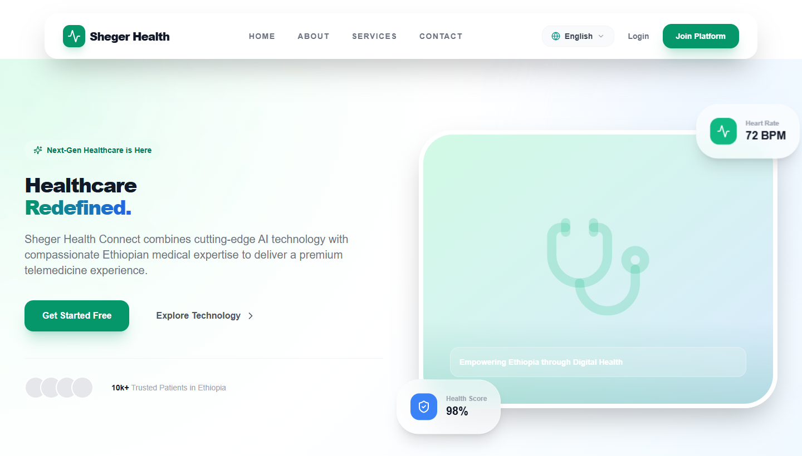
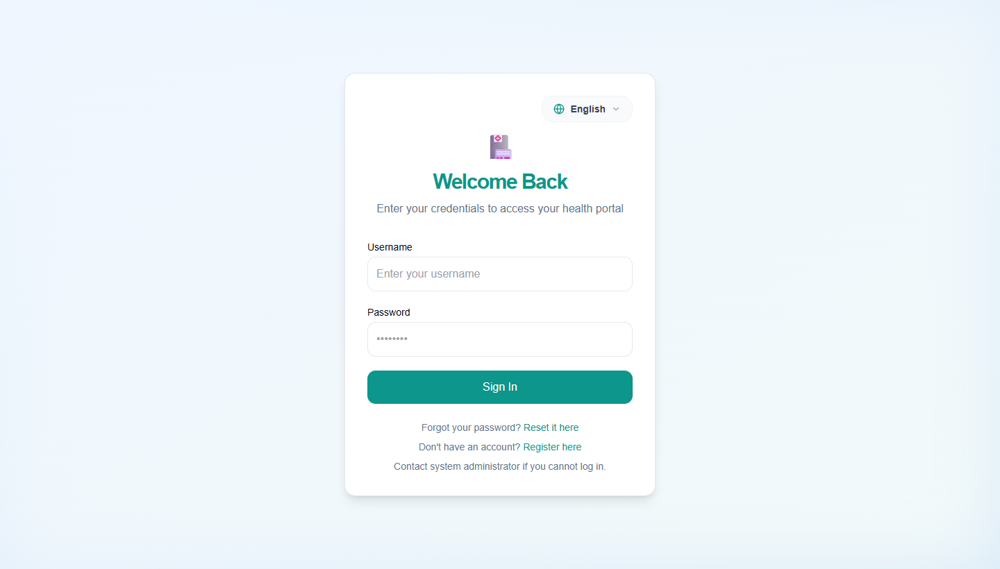
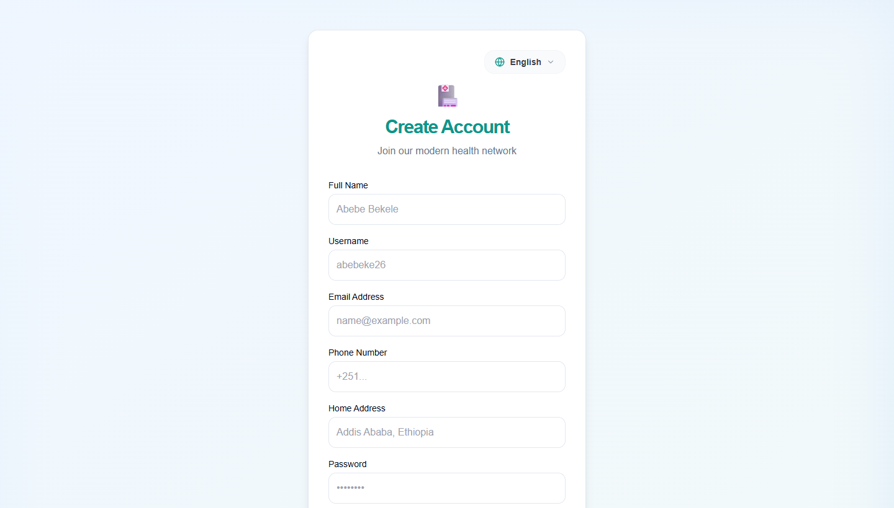
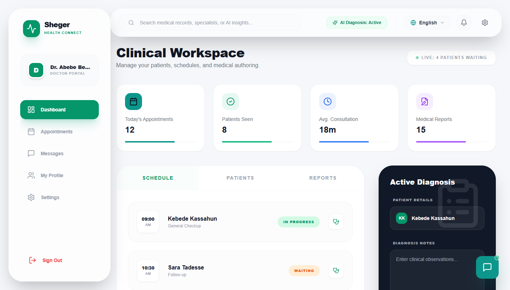
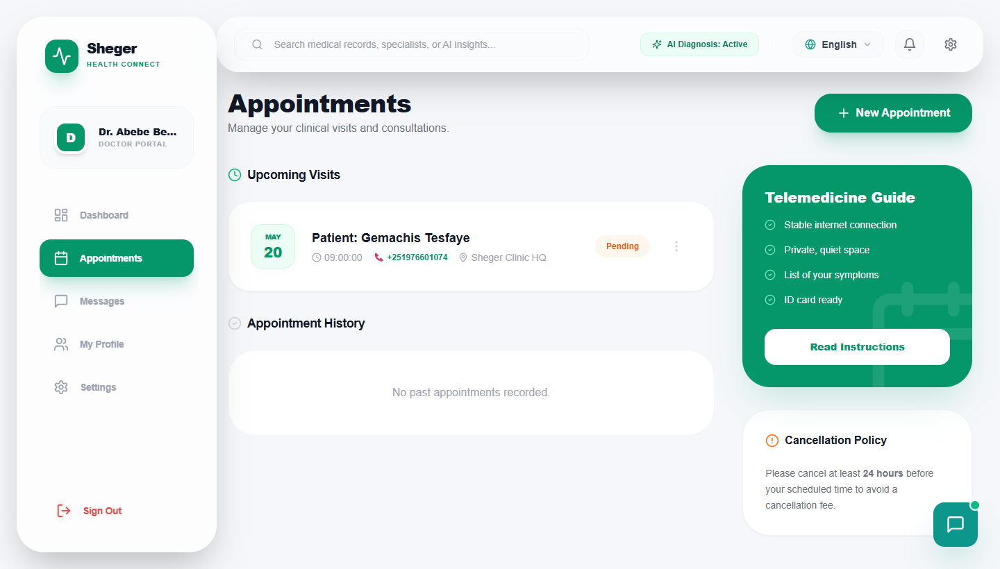
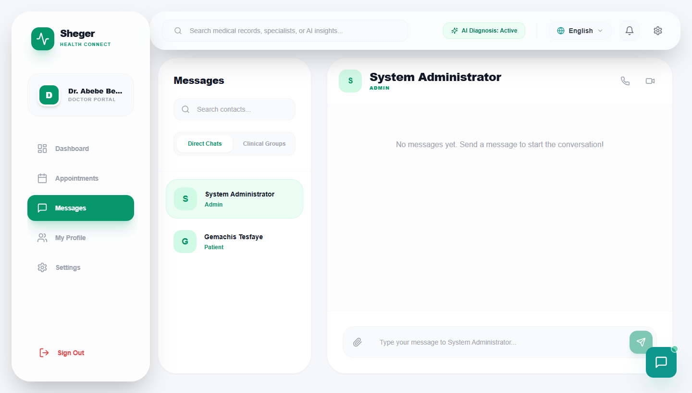
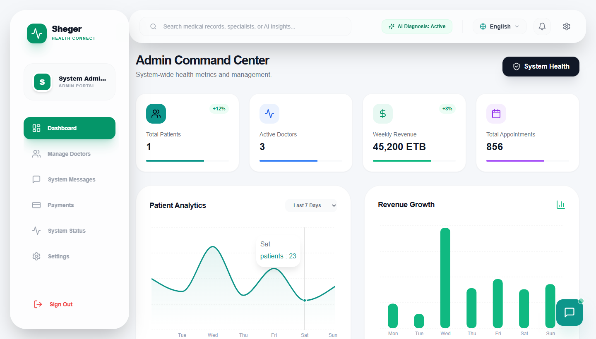
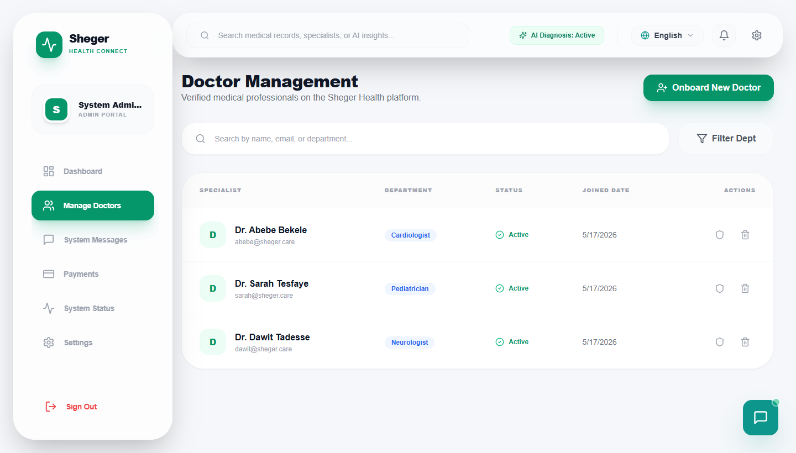
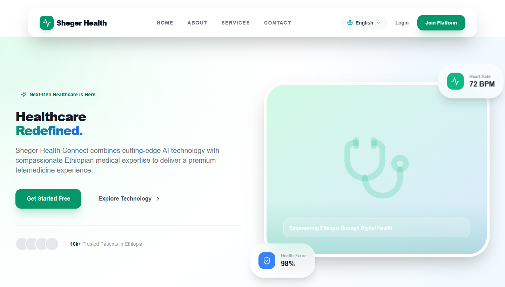

# 🏥 Sheger Health Connect

<p align="center">
  <a href="https://sheger-health-connect.vercel.app" target="_blank">
    
  </a>
</p>

<p align="center">
  <a href="https://sheger-health-connect.vercel.app"></a>
  <a href="https://sheger-health-connect.onrender.com"></a>
  
  
  
</p>

---

## 🌐 Live Deployments
| Service | URL |
|---|---|
| 🌍 **Frontend App** | [sheger-health-connect.vercel.app](https://sheger-health-connect.vercel.app) |
| ⚙️ **Backend REST API** | [sheger-health-connect.onrender.com](https://sheger-health-connect.onrender.com) |

---

## 📸 Platform Screenshots

| 🏠 Landing Page | 🔐 Login Gateway | 📝 Registration |
| :---: | :---: | :---: |
|  |  |  |
| **🩺 Doctor Dashboard** | **📅 Doctor Appointments** | **💬 Doctor Messages** |
|  |  |  |
| **🔑 Admin Dashboard** | **👨‍⚕️ Admin Doctor Manager** | **👤 Patient Experience** |
|  |  |  |

---

## 🚀 Key Features

### 👤 Three Role-Based Portals

| Role | Access & Capabilities |
|---|---|
| 🔑 **Admin** | Manage all Doctors & Patients, view system logs, track payments, send messages to any user |
| 🩺 **Doctor** | Manage appointments, view patient histories, isolated direct messaging, group staff chat |
| 👤 **Patient** | Browse specialists, book consultations, view medical vault, AI triage assistant |

### 🛠️ Core Functional Modules
- **💬 Isolated Direct Messaging** — Fixed message routing so doctor-patient conversations are fully private with no cross-leak
- **🤕 Interactive Symptoms Checker** — Smart triage widget guiding patients to the right specialist instantly
- **🔒 Logout Confirmation Modal** — Prevents accidental session termination with a secure confirm prompt
- **🧼 Clean Seeder Utility** — Admin-triggered DB reset clears all test data for a pristine environment
- **🧠 AI Triage (GPT-4)** — Intelligent health consultation with smart offline fallback responses
- **🌐 Multilingual** — Full English, Amharic (አማርኛ), and Afaan Oromoo support across all UI components
- **📊 System Analytics** — Real-time charts for appointments, patient counts, and revenue tracking

---

## 🛡️ Security Architecture

| Layer | Implementation |
|---|---|
| 🔐 **Authentication** | JWT tokens (24h expiry), Username-based login |
| 🔑 **Authorization** | RBAC — strict role separation enforced on every route |
| 🔒 **Password Storage** | bcrypt salted hashing — no plaintext ever stored |
| 🛡️ **SQL Safety** | Sequelize ORM with parameterized queries, no raw SQL |
| 🌐 **CORS** | Restricted to authorized frontend origins only |
| 🚫 **Registration** | Public registration disabled — admin-controlled onboarding only |

---

## 💻 Tech Stack & Tools

### Frontend
| Technology | Purpose |
|---|---|
| **React.js (Vite)** | Core SPA framework |
| **Tailwind CSS** | Utility-first premium styling |
| **Framer Motion** | Smooth animations & micro-interactions |
| **i18next** | Multilingual internationalization (EN / AM / OM) |
| **Lucide React** | Modern medical & dashboard iconography |
| **Recharts** | Admin analytics & data visualization |
| **React Router v6** | Client-side routing & protected role-based routes |
| **Socket.io Client** | Real-time messaging events |

### Backend
| Technology | Purpose |
|---|---|
| **Node.js & Express** | REST API server with MVC architecture |
| **Sequelize ORM** | Schema migrations & safe DB operations |
| **MySQL** | Relational database for users, appointments & records |
| **Socket.io** | Bidirectional real-time messaging events |
| **OpenAI SDK (GPT-4)** | AI triage assistant with fallback support |
| **bcrypt** | Industry-standard password salting & hashing |
| **JWT** | Stateless secure session tokens |
| **Multer** | File & image upload handling |
| **Nodemailer** | Email notification integration |

---

## ⚙️ Local Setup & Installation

### Prerequisites
- Node.js v18+
- MySQL Server running locally

### 1. Backend Setup
```bash
cd backend
npm install

# Create a .env file with:
# DB_HOST=localhost
# DB_USER=root
# DB_PASS=yourpassword
# DB_NAME=sheger-health-connect
# JWT_SECRET=your_secret
# OPENAI_API_KEY=your_openai_key

npm run dev
```

### 2. Frontend Setup
```bash
cd frontend
npm install
npm run dev
```

### 3. Seed the Database
```bash
cd backend
node seed-admin.js
```

### 4. Default Login Credentials
| Role | Username | Password |
|---|---|---|
| Admin | `admin` | `Admin@2026` |
| Doctor | `dr_abebe` | `Password@123` |
| Doctor | `dr_sarah` | `Password@123` |
| Doctor | `dr_dawit` | `Password@123` |

---

## 📊 System Architecture
```
Frontend (React/Vite) ─── REST API ──► Backend (Express/Node.js)
        │                                        │
  Socket.io Client ◄──── WebSocket ────► Socket.io Server
                                                 │
                                        MySQL (via Sequelize)
```

---

## 🗂️ Documentation
All docs are inside the [`docs/`](docs/) folder:
- [api.md](docs/api.md) — REST API endpoints
- [database.md](docs/database.md) — Schema & models
- [deployment.md](docs/deployment.md) — Production deployment guide
- [features.md](docs/features.md) — Full feature list
- [installation.md](docs/installation.md) — Setup instructions
- [progress.md](docs/progress.md) — Development progress log
- [security.md](docs/security.md) — Security policies

---

<p align="center">© 2026 Sheger Health Connect · Designed & Developed by <strong>Gemachis Tesfaye</strong></p>
